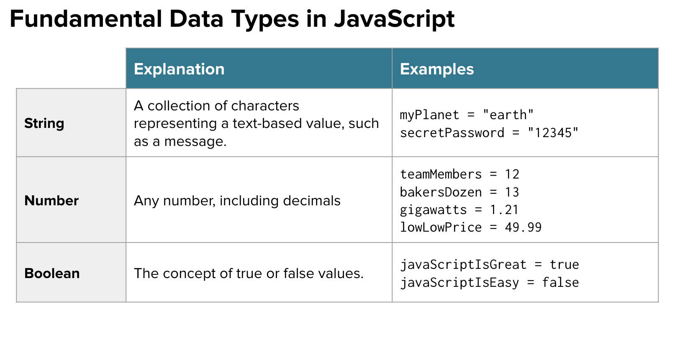

[](https://generalassemb.ly)
# The Basics

[VIDEO 2]()

#### Programming Fundamentals

<p>Every programming language can be broken down into core components. Having a general framework for this context will help us learn specifics for JavaScript.</p>

1. Syntax
- The structure of the commands given to the computer
2. Variables
- How computers store specific pieces of information
3. Control Flow
- Creates the order of operations for a program and allows programs to choose different pieces of code to run
4. Data Structures
- How computers organize information

 #### Variables

Variables are names that have been assigned to specific values or data.

JavaScript allows us to easily define and redefine variables using a simple assignment operator (equals sign). 

```js
const greatProgrammingLanguage = 'JavaScript'
let klondikesAge = 6
let codingIsFun = true
```
- Variable names in JavaScript should be lowercase unless there are multiple words like the above example using camelCase. 
- A variable’s name should represent what information it is holding. This will make your code readable to yourself and others.

The three above examples represent our most basic primitive data types.<br>


 #### Arithmetic Operators
