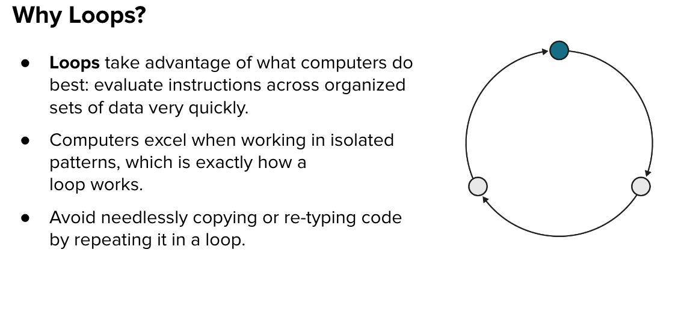

[](https://generalassemb.ly)
# Control Flow - Looping

[VIDEO 6 - Looping]()<br>

## Looping

Loop: A control flow statement allowing for the repeated execution of a code block until a specific condition is reached.



### for loop


When creating a `for` loop, we need three declarations:

1. Define a variable - the iterator (i)
2. Terminating condition to end the loop
3. Increment/Decrement the iterator variable
:mag_right: Review the syntax<br>
Notice the `;` between each component of the `for` loop.
```js
for(let i = 0; i < 10; i++){
  console.log(i)
}
//0
//1
//2
// up to 9
// stops at 9 because the terminating condition is i < 10
```

### for loop + arrays

Looping is great with arrays. It allows you to move through a large set of data and manipulate or check information.<br>
:mag_right: Review the syntax<br>
Usually we want to loop through the whole array, so we will use the length property for arrays `dogs.length`.
```js
const dogs = ['Klondike', 'Missy', 'Star']
for(let i = 0; i < dogs.length; i++){
  console.log(dogs[i])
}
//output as follows
//'Klondike'
//'Missy'
//'Star'
```

### while loop

A `while` loop is similar to the `for` loop but only takes in a terminating condition. While the terminating condition is true the loop will keep running.<br>
Simple games are a great way to utilize a `while` loop.<br>
:mag_right: Review the syntax<br>

```js
let playerHealth = 100
//attack function
function attack(){
  playerHealth -= 10
}
while(playerHealth > 0){
  //invoke the attack function to reduce playerHealth
  attack()
  //show playerHealth value each time the loop is repeated
  console.log(playerHealth)
}
//demonstrate end of while loop, computer exited loop and ran following console.log
console.log('Game Over, playerHealth <= 0')
```

#### Tip! :bulb:
There are many other ways to loop in a program, but we are keeping it simple for this lesson. 

## YOU DO :computer:

[CodePen Looping](https://codepen.io/Katie22/pen/bGOEaNj)