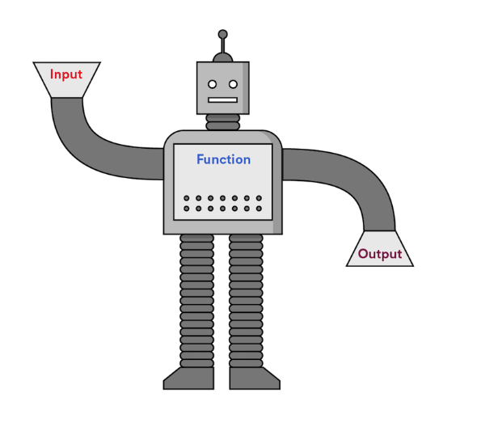

[](https://generalassemb.ly)
# Control Flow - Functions

[VIDEO 6 - Functions]()<br>

## Functions
Functions are chunks of code that can be used repeatedly simply by invoking them. They perform tasks or calculate values. A function will typically have an input and produce an output. 

:mag_right: Review the syntax <br>

```js
function displayGreeting(){
  console.log('Hello my friend!')
}
```
The above function has been defined, but nothing will happen unless we invoke the function. We simply invoke functions like so:
```js
displayGreeting()
```
As mentioned above, you can run this function as many times as you would like if we need to greet many users on our website. This keeps our code DRY (don't repeat yourself).<br><br>

`displayGreeting()` is a very simple function that doesn't offer a lot of options. How can you build a function that greets someone specifically by their name?<br>
Parameters and Arguments!
1. Parameters are variable names within the function
2. Arguments are the values passed into the function

Let's make our `displayGreeting()` function more interesting.
```js
function displayGreeting(name){
  console.log('Hello '+ name + ', thanks for visiting my website.' )
}
```
Not done yet! We will need to invoke it, let's run it a few times.
```js
displayGreeting('Bob')
displayGreeting('Sue')
```
1. The parameter: name
2. The arguments: 'Bob' and 'Sue'


