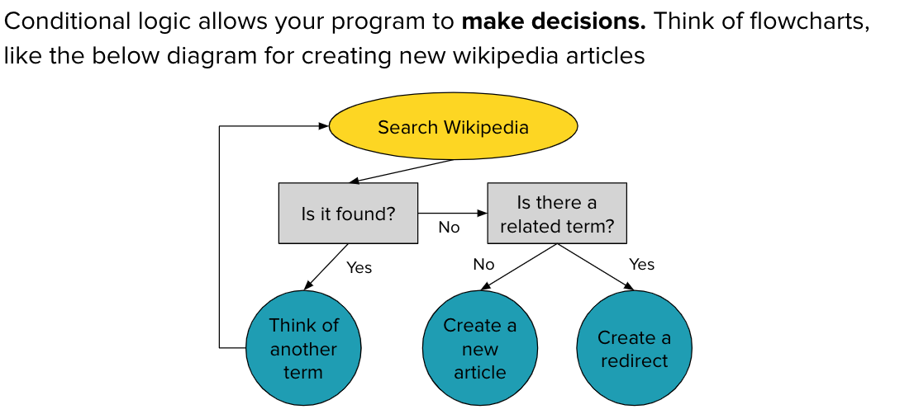
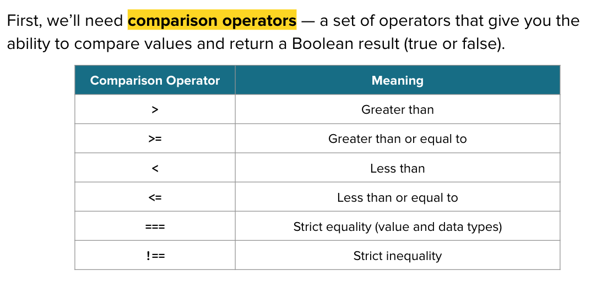

[](https://generalassemb.ly)
# Control Flow - Conditionals

[VIDEO 5 - Conditionals](https://generalassembly.zoom.us/rec/share/ROi-Q6o9jqPIUmLoMyzOfxU_rkWmSgR6B7-XsnFoqrvnGJajXjg943xsV7PI580U.CLqCHHp4fHD9ah5t?startTime=1706739184000)<br>

## Conditionals

[In the basics section](./part2.md), we listed 4 programming features for any language. Now we will cover control flow. Instead of top of the file to the bottom (sequential) as seen up to this point, we will write code to check for conditions and run the code according to those matches.




### if statement
:mag_right: Review the syntax <br>
```js
let klondikeAge = 6
let missyAge = 6
if(klondikeAge === missyAge){
  console.log('true! aka truthy')
}
```

Inside the parenthesis after the `if` the computer is checking whether the comparison/boolean is truthy or falsey. In the case above, the two variables match, therefore it is truthy and the CODE BLOCK inside the `{}` will run.<br>
If it was not truthy, the CODE BLOCK inside the `{}` would not run and the computer would skip over and move down the file.

### else statement
:mag_right: Review the syntax <br>
```js
let klondikeAge = 6
let missyAge = 7
if(klondikeAge === missyAge){
  console.log('skipped since no longer truthy ')
} else {
  console.log('a catch all, will run if no other if or else if statement is truthy ')
}
```
### else if statement - chaining multiple conditions
:mag_right: Review the syntax <br>
```js
let klondikeAge = 6
let missyAge = 7
if(klondikeAge === missyAge){
  console.log('nope, only runs if the values match')
} else if(klondikeAge < missyAge){
  console.log('yep! this is truthy and will run')
} else {
  console.log('nope, built in case no truthy above, but in this case it will be skipped')
}
```
#### Tip! :bulb: You can have as many conditions as fits your program. There is a lot of flexibility with conditionals.

#### Tip! :bulb: When comparing equality, always use `===`. Many new students forget this and use `=`. If you are getting a strange result, check your comparison operator.<br>
Check out the below example, will the CODE BLOCK inside the `{}` run? Not sure? Open a codepen and try it out for yourself.

:mag_right: Review the syntax <br>

```js
let temp = 30
if(temp = 100){
  console.log('What is the temp??? Maybe I should console.log the temp after the statement...')
}
console.log(temp)
```

## YOU DO :computer:

[CodePen Conditionals](https://codepen.io/Katie22/pen/gOEmzyE)