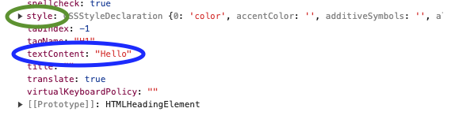

# DOM - Document Object Model

[VIDEO 8 - DOM](https://generalassembly.zoom.us/rec/share/IGyFlYRSheHzhZUr-pMU1qqkcw6_wCBjNeow5rsXCn3nu2Eq4IbhNC9qLrkEilxo.Yynx97nxvCVpWZT7?startTime=1706805447000)<br>

## What is the DOM?
The [Document Object Model](https://developer.mozilla.org/en-US/docs/Web/API/Document_Object_Model/Introduction), commonly referred to as the "DOM", is a programming interface for HTML. When you load HTML into the browser, it gets converted into a dynamic object-based structure.<br>

### Keeping it simple
Unit 1 will cover this information much more deeply. Since the DOM is covered in the prework, we will cover just the basic code to work with the DOM.

#### Getting Data from the DOM
There are a few ways, but a simple and inclusive DOM method is `document.querySelector()`

The following is a list of CSS selectors and the JavaScript equivalents you would use with `querySelector`:

| CSS Selector  | JS Selector   |
| ------------- | ------------- |
| `.class-name` | `.class-name` |
| `#id-name`    | `#id-name`    |
| `h1`          | `h1`          |

Review the HTML below:

```html
<!DOCTYPE html>
<html lang="en">
<head>
  <meta charset="UTF-8">
  <meta name="viewport" content="width=device-width, initial-scale=1.0">
  <link rel="stylesheet" href="./styles.css">
  <script defer src="./app.js"></script>
  <title>DOM</title>
</head>
<body>
  <h1 class="title" id="first-title">Hello</h1>
</body>
</html>
```
I want to select the `h1` in the html above. We can do it three ways with `querySelector`<br>
:mag_right: Review the syntax <br>
1. Select by the element
```js
const h1Tag = document.querySelector('h1')
```
2. Select by the class
```js
const h1Class = document.querySelector('.title')
```
3. Select by the id
```js
const h1Id = document.querySelector('#first-title')
```
A variable was created to hold the element. Notice :mag_right: that the argument passed into the `querySelector` is always wrapped with quotes.
1. element gets element name 
2. class gets a `.` -> just like we select classes in css
3. id gets a `#` -> just like we select ids in css

#### Using the Dev Tools to understand the DOM

We can select DOM elements like `h1Class` above and inspect them in the browser with `console.dir()`



Let's take a look at `textContent`<br>
Notice how the value is Hello, just like our HTML!<br>
We can change the text by accessing `textContent`<br>
HTML is converted into an object (DOM), hence dot notation is used to get textContent
```js
h1Class.textContent = 'Wow, the DOM is fun!'
```

#### style
Notice that style is just above `textContent`. Since it has an arrow, it has all kinds of properties within, it is its own object. Let's change the font color of our `h1`.

```js
h1Class.style.color = 'blue'
```

## YOU DO :computer:

[CodePen DOM](https://codepen.io/Katie22/pen/xxBqyGY)


